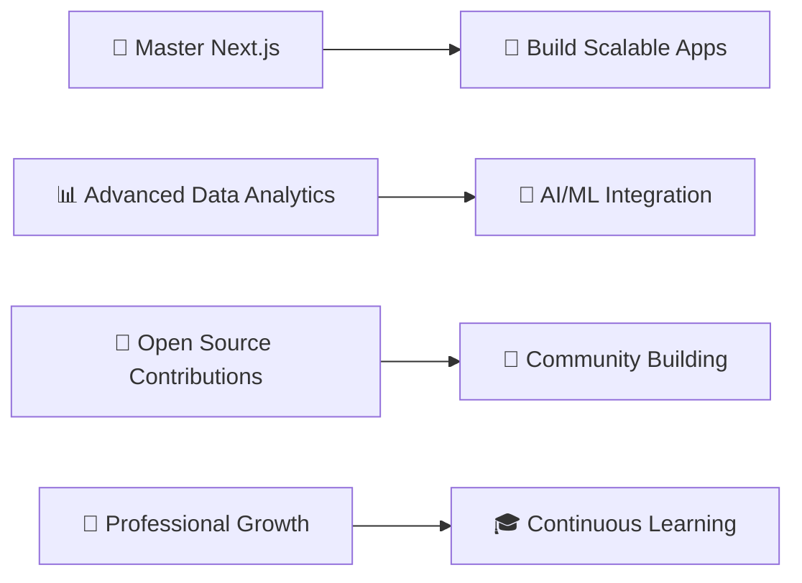

# 
👋 Hello World! I'm **Saujanya Magarde** 🚀

  

---

## 🎯 **What I'm Up To**

<table>
<tr>
<td width="50%">

### 🔭 **Currently Working On**
- 🌐 **Open Source Contribution** in [AsyncAPI Initiative](https://www.asyncapi.com/)
- 🚗 **Roadway** - Advanced ride booking platform
- 📊 **Data Analytics** projects using AI & LLMs

### 🌱 **Currently Learning**
- ⚡ **Next.js** - React Framework for Production
- 🔷 **TypeScript** - Superset of JavaScript
- 🤖 **AI/ML** - Large Language Models

</td>
<td width="50%">

### 🎓 **Experience**
- 💼 **Data Analyst Intern**
- 🧠 Specializing in **Data Analytics using AI - LLMs**
- 🔍 Transforming data into actionable insights

### 🤝 **Looking for Collaboration**
- 🚀 **Full-stack Development** projects
- 🌟 **Open Source** contributions
- 📈 **Data Science** initiatives

</td>
</tr>
</table>

---

## 🌐 **Connect With Me**

---

## 💻 **Tech Arsenal**

### **Languages**

### **Frontend Development**

### **Backend & Database**

---

## 📊 **GitHub Analytics**

---

## 🏆 **Achievements & Recognition**

---

## 💭 **Daily Inspiration**

---

## 🔝 **Top Contributed Repositories**

---

## 🎯 **Current Goals for 2025**

```mermaid
graph LR
    A[🎯 Master Next.js] --> B[🚀 Build Scalable Apps]
    C[📊 Advanced Data Analytics] --> D[🤖 AI/ML Integration]
    E[🌟 Open Source Contributions] --> F[👥 Community Building]
    G[💼 Professional Growth] --> H[🎓 Continuous Learning]
```

---

### 🌟 **"Code is like humor. When you have to explain it, it's bad."** 🌟

**Thanks for visiting! Let's build something amazing together! 🚀**

---

  

